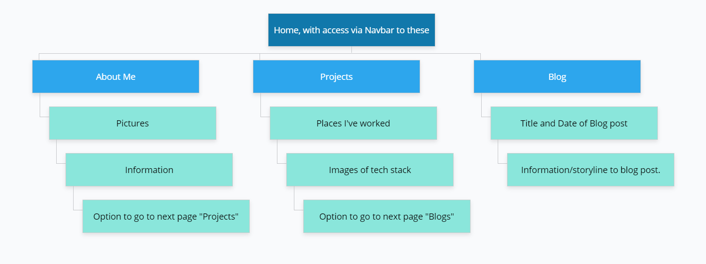
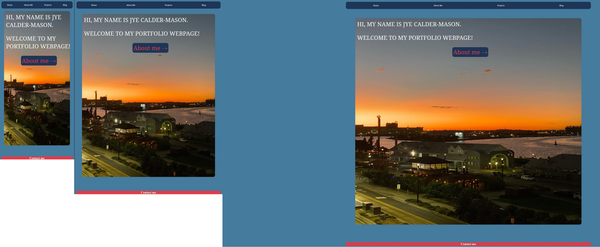
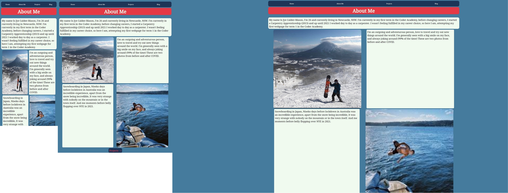
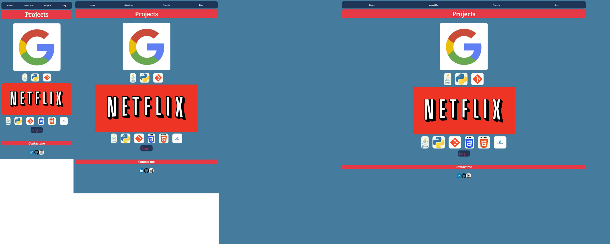
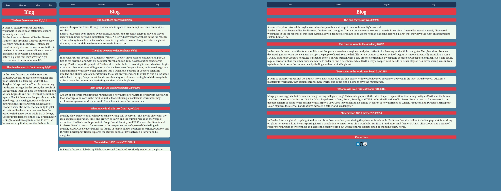

# (Jye Calder-Mason) T1_A2_Portfolio 

Website: https://jyenese.github.io/Jye-CoderAcademy.github.io/

Github:https://github.com/jyenese/Jye-CoderAcademy.github.io

## Purpose

The purpose of my portfolio is to show a potential employer my skills, education, attitude with work, and contact information.

## Functionality / Features

The website has four main navigations in the navbar that should take you to every part of information neccessary. Website is responsive with mobile,tablet or browser. Each page has its own 'next navigation bar' on each page to make it easier to skim through it. A lot of the website has been done with flexbox and sass. Every page has the same footer with my personal linkedin, github, and resume.

## Sitemap

1. All Pages have;
- Nav bar with four main features (Home, About Me, Projects and Blog)
- Nav bar with hover features
- Happy and vibrant color scheme.
- A Footer with a 'Contact Me' header, following with img links to the following;
    - Linked In
    - Github
    - Resume

2. Home
- A photo of gods country (Newcastle)
- Text including a welcome and my name.
- Option to use a button named 'About me' which takes you to the next page in the list, being 'about me.

3. About Me
- Information about myself (previous career, what I'm doing now, hobbies)
- Photo of me in Niseko, and a photo of me moment before failure.
- Option to use a button named 'Projects' which takes you to the next page in the list.

4. Projects
- Includes two bigger images of companys I used to work at (Google and Netflix)
- Underneath each logo shows the tech stacks I used in each of them, respectfully.
- Option to use a button named 'Blog' which takes you to the next page in the list.

5. Blog
- Includes a title and date for each blog post
- Includes the blog underneath each of the 5 titles.

## Screenshots; iPhone > iPad > Browser
#### Home Page

#### About Me

#### Projects

#### Blog

## Target Audience
- The target audience is a potential employer who might want to look at my work experience, and previous works.

## Tech Stack
- HTML
- CSS
- SASS
- Google Fonts
- Git and Github
- Balsamiq (For wireframes)